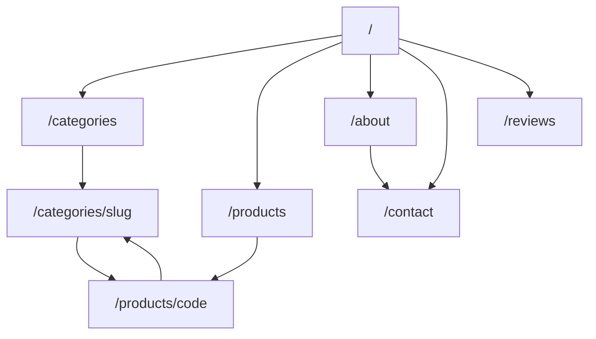

# Saluvia Web — Full Website Blueprint

> **Status:** Implementation in progress (`web/` Next.js app).  
> **Brand:** Saluvia — B2B electrosurgical & medical instruments.  
> **Catalog source:** `Zip/` (JSON + images), linked into the Next.js app.  
> **Stack:** Next.js (App Router) · TypeScript · Tailwind CSS v4 · Framer Motion

This README is the single source of truth for structure, SEO, design tokens, and how pages are built.

---

## Table of contents

1. [Project overview](#1-project-overview)
2. [Tech stack & how to run](#2-tech-stack--how-to-run)
3. [Design system (single source of truth)](#3-design-system-single-source-of-truth)
4. [Catalog & data inventory](#4-catalog--data-inventory)
5. [Site map & URL architecture](#5-site-map--url-architecture)
6. [Global layout (header / footer)](#6-global-layout-header--footer)
7. [Home page architecture](#7-home-page-architecture)
8. [Categories pages](#8-categories-pages)
9. [Products pages](#9-products-pages)
10. [About page](#10-about-page)
11. [Contact page](#11-contact-page)
12. [Reviews / testimonials](#12-reviews--testimonials)
13. [SEO strategy](#13-seo-strategy)
14. [Content & JSON files to create](#14-content--json-files-to-create)
15. [Implementation phases](#15-implementation-phases)
16. [Design & UX principles](#16-design--ux-principles)
17. [Multi-agent build plan](#17-multi-agent-build-plan)

---

## 1. Project overview

Saluvia is a professional **B2B medical instruments** website for hospitals, clinics, distributors, and OEM buyers. The catalog focuses on electrosurgical lines:

- Bipolar & monopolar forceps (reusable, single-use, non-stick, ultra non-stick, European style)
- Electrodes, pencils, cables
- Gynecology & arthroscopic instruments
- Diathermy instruments, scissors/clamps, retractors, sterilization trays

**Business model on the site:** catalog + inquiry / quote (no public cart pricing in v1).

**Primary goals**

| Goal | How the site supports it |
|------|---------------------------|
| Discover products by category & code | Search, filters, category hub |
| Trust & professionalism | About, quality pillars, certifications, reviews |
| Convert to B2B leads | Quote CTAs, contact form with product codes |
| Rank for instrument + brand queries | SEO-ready routes, schema, internal linking |

---

## 2. Tech stack & how to run

### Stack

| Layer | Choice |
|-------|--------|
| Framework | **Next.js** (App Router, TypeScript) |
| Styling | **Tailwind CSS v4** |
| Motion | **Framer Motion** |
| Icons | `lucide-react` |
| Design tokens | `web/src/styles/design-system.css` only |
| Catalog data | `web/data` → junction to `Zip/Zip/data` |
| Images | `web/public/images` → junction to `Zip/Zip/images` |

### App location

All application code lives in **`web/`**.

```bash
cd web
npm install
npm run dev
```

Open [http://localhost:3000](http://localhost:3000).

| Script | Purpose |
|--------|---------|
| `npm run dev` | Local development |
| `npm run build` | Production build |
| `npm run start` | Serve production build |
| `npm run lint` | ESLint |

### User journey (wired)

1. **Home** — hero, image slider, featured products, category families  
2. **Categories** (`/categories`) — all categories with representative images  
3. **Category** (`/categories/[slug]`) — products for that category  
4. **Product** (`/products/[code]`) — detail, specs, related, quote CTA  
5. **About / Contact / Reviews** — trust + B2B inquiry  

---

## 3. Design system (single source of truth)

**Change colors / radii / shadows in one file only:**

`web/src/styles/design-system.css`

Do **not** hardcode hex colors in page components. Pages use Tailwind tokens mapped from CSS variables (`bg-brand`, `text-ink`, `border-border`, `bg-accent`, etc.).

### Palette (clinical teal + slate)

| Token | Role |
|-------|------|
| `--brand` / `--brand-deep` | Primary navy-teal identity |
| `--accent` / `--accent-bright` | CTA & highlights |
| `--bg` / `--bg-elevated` | Mist background + surfaces |
| `--ink` / `--ink-soft` / `--ink-muted` | Typography hierarchy |
| `--border` / `--ring` | Borders & focus |

### Fonts

- Display: **Sora** (`font-display`)
- Body: **Manrope** (`font-sans` / `--font-body`)

### Motion

- Framer Motion for section reveals, slider, mobile nav, product hover lifts  
- Respects `prefers-reduced-motion` (see `globals.css` + component hooks)

To re-theme the whole site later: edit **only** `design-system.css` (and optionally font imports in `layout.tsx`).

---

## 4. Catalog & data inventory

### What already exists in `Zip/`

```
Zip/
├── Zip.zip                    # Archive of the same content
└── Zip/
    ├── data/
    │   ├── categories.json    # 46 categories (name, slug, url)
    │   ├── progress.json      # Per-category scrape status & product counts
    │   └── products/
    │       └── {category-slug}.json   # 46 files, ~572 products total
    └── images/
        └── {category-slug}/{product-slug}/
            ├── main_full.webp
            ├── main_medium.webp
            └── thumb.webp     # ~1,716 images total
```

### Product JSON fields (per SKU)

| Field | Use on site |
|-------|-------------|
| `title` | Product name / H1 |
| `code` | SKU badge, URL key, search (e.g. `110-100`) |
| `category_name` / `category_slug` | Breadcrumbs, filters, PLP |
| `short_description` | Cards, meta snippets |
| `variants` | Spec table (Tip, Size, etc.) |
| `note` | Compliance / usage callout when present |
| `images.full` / `medium` / `thumb` | Gallery & grids |
| `related_products` | PDP related carousel |

### Counts (from current data)

| Asset | Count |
|-------|------:|
| Categories | 46 |
| Products (SKUs) | ~572 |
| Product images (WebP) | ~1,716 |

### Missing content (to create later)

| File | Purpose |
|------|---------|
| `about.json` | Company story, mission, quality, markets, HQ contact |
| `reviews.json` | Testimonials for homepage + `/reviews` |
| `homepage.json` | Hero copy, slider slides, featured product codes, solution tiles |
| `contact.json` *(optional)* | Multi-office / channel overrides if not embedded in `about.json` |

---

## 5. Site map & URL architecture

### Primary routes

| Route | Page | Indexable |
|-------|------|-----------|
| `/` | Home | Yes |
| `/about` | About | Yes |
| `/contact` | Contact | Yes |
| `/categories` | Categories index | Yes |
| `/categories/[slug]` | Category listing (PLP) | Yes |
| `/products` | Full catalog | Yes |
| `/products/[code]` | Product detail (PDP) | Yes |
| `/reviews` | Testimonials (optional if ≥6 reviews) | Yes |
| `/privacy` | Privacy policy | Yes (when final) |
| `/terms` | Terms of use | Yes (when final) |
| `/sitemap.xml` | XML sitemap | — |
| `/robots.txt` | Crawl rules | — |

### URL conventions

- **Categories:** keep existing slugs from `categories.json`  
  Examples: `bipolar-forceps`, `electrodes-2-4-mm-non-stick`
- **Products:** prefer **code-first** stable URLs for B2B procurement  
  Example: `/products/110-100`  
  Image folders keep descriptive slugs (`mcpherson-straight-ti-110-100`); route key remains `code`.
- **Filters:** query params only (`?q=`, `?category=`, `?sort=`); canonical URLs stay clean.
- **Trailing slash:** pick one policy sitewide and stick to it.

### Navigation IA (mermaid)



---

## 6. Global layout (header / footer)

### Header (all pages)

- Logo → Home
- Nav: **Products** · **Categories** · **About** · **Contact**
- Highlighted CTA: **Request Quote** → `/contact` (or modal)
- Search: product name or code → `/products?q=…`
- Mega-menu (desktop): group 46 categories into **8–10 families** (Forceps, European Forceps, Single-Use, Electrodes, Cables, Gynecology, Diathermy, Accessories)

### Footer

- Grouped category links
- About · Contact · Reviews · Privacy · Terms
- Professional-use disclaimer
- Organization contact (phone, email, address placeholders)

---

## 7. Home page architecture

**Route:** `/`  
**Goal:** One professional first impression → browse catalog → request quote.

### Section order (build in this sequence)

| # | Section | Anchor | Purpose |
|---|---------|--------|---------|
| 1 | **Hero** | `#hero` | Brand + primary value prop + CTAs |
| 2 | **Image slider** | `#gallery` | Showcase multiple product / facility images |
| 3 | **Quick category strip** | `#browse` | Fast chips into top product families |
| 4 | **Company overview** | `#overview` | Short “who we are” for the website |
| 5 | **Top-selling / featured products** | `#featured` | Flagship SKUs (curated) |
| 6 | **Category showcase** | `#categories` | Family cards into the catalog |
| 7 | **Solutions by specialty** | `#solutions` | Use-case journeys (Neuro/ENT, Gyn, Arthroscopy, OR cables) |
| 8 | **Why Saluvia** | `#quality` | Quality / coating / reusable vs single-use pillars |
| 9 | **Reviews teaser** | `#reviews` | 3 testimonials (when data exists) |
| 10 | **Find by product code** | `#find-product` | Code-first search CTA |
| 11 | **Contact / quote band** | `#contact` | Mini inquiry form or CTA to Contact |
| 12 | **Footer** | — | Secondary SEO nav |

### Section details

#### 5.1 Hero

- **H1:** brand-forward (e.g. *Saluvia — Precision Electrosurgical Instruments*)
- One short supporting sentence (breadth: forceps, electrodes, cables; B2B)
- CTAs: **Browse Catalog** · **Request Quote**
- Optional trust strip: *572+ products · 46 categories · Reusable & single-use*
- Full-bleed hero visual (product/OR atmosphere) — not a small inset card

#### 5.2 Image slider

- 5–8 slides (autoplay ~5s, pause on hover; swipe on mobile)
- Caption: product title + code when slide maps to a SKU
- Prefer `images.medium`; link slide → product or category
- Controlled via `homepage.json` → `featuredSlides[]`

#### 5.3 Quick category strip

- 6–8 chips: Forceps, Electrodes, Cables, Gynecology, Diathermy, Single-Use, Accessories
- Counts from `progress.json`

#### 5.4 Company overview

- 2-column narrative: quality manufacturing, specialties served, reusable + disposable lines
- Link: **Learn more** → `/about`

#### 5.5 Top-selling / featured products

- 8–12 product cards (thumb, title, **code**, category badge, variant hint)
- Curated list in `homepage.json` → `featuredProductCodes[]` (no sales analytics in catalog yet)
- Fallback: one hero SKU per major family
- CTA: **View all products** → `/products`

#### 5.6 Category showcase

- Show **family cards** (not all 46 tiles): name, blurb, product count, representative image
- Each card → `/categories/[slug]` or family landing
- **All categories** → `/categories`

#### 5.7 Solutions by specialty

- Tiles mapping buyer intent → category sets (Neuro/ENT forceps, Gynecology electrosurgery, Arthroscopy, Cables & pencils)

#### 5.8 Why Saluvia

- Pillars: Non-stick / Ultra non-stick · Reusable & single-use · Code traceability · Sterilization-ready design
- Certification logos as placeholders until confirmed

#### 5.9 Reviews teaser

- 3 approved homepage testimonials from `reviews.json`
- CTA → `/reviews` only if enough content exists

#### 5.10 Find by product code

- Prominent search: “Search by product code or name”
- Quick links to popular codes

#### 5.11 Contact / quote band

- Split layout: short form (name, org, email, product codes, message) **or** strong CTA to `/contact`
- Phone / email / hours on the side

### Homepage SEO

| Element | Pattern |
|---------|---------|
| Title | `Saluvia \| Electrosurgical Instruments — Forceps, Electrodes & Cables` |
| H1 | One only (hero) |
| Meta | ~155 chars: breadth + B2B + SKU count |
| Schema | `Organization` + `WebSite` (+ `SearchAction`) + optional `ItemList` for featured |
| OG | Hero image 1200×630 |

---

## 8. Categories pages

### 6.1 Categories index — `/categories`

**Sections**

1. Hero — H1 *Product Categories*, one-line B2B value prop  
2. Search + optional A–Z jump  
3. Category grid (3–4 cols) — name, product count, representative thumb  
4. CTA — Browse full catalog → `/products`  
5. Inquiry strip  

**SEO**

- Title: `Electrosurgical Product Categories | Saluvia`
- Schema: `ItemList` of categories
- Canonical: `/categories`

### 6.2 Category detail — `/categories/[slug]`

**Sections**

1. Breadcrumbs: Home › Categories › {Category}  
2. Header — H1 = category `name`, intro blurb (CMS / later category description), product count  
3. Toolbar — scoped search, sort, link to `/products?category=[slug]`  
4. Filters (sidebar / mobile drawer) — facets from `variants` (Tip, Size, …)  
5. Product grid — cards (see shared card below)  
6. Related / sibling categories (e.g. Non-Stick variants of same family)  
7. Sticky CTA — Request quote for this category  

**SEO**

- Title: `{Category Name} | Saluvia`
- Schema: `BreadcrumbList` + `CollectionPage` / `ItemList`
- Canonical: `/categories/[slug]`
- **Content gap:** unique 80–150 word category blurbs (high SEO priority)

---

## 9. Products pages

### Shared product card

- Thumb (`images.thumb`)
- Title
- **Code** (prominent)
- Category chip
- Variant summary (e.g. Tip · Size)
- One-line `short_description`
- Link → `/products/[code]`
- Optional: “Add to inquiry” (B2B list, no price)

### Shared listing toolbar

- Search (title, code, description)
- Sort: Relevance · A–Z · Code · Category
- Result count
- Grid / list toggle

### 7.1 Products catalog — `/products`

**Sections**

1. Breadcrumbs: Home › Products  
2. H1 *Product Catalog* + total SKU count  
3. Two-column: **filter sidebar** | **results**  
4. Active filter chips + clear all  
5. Paginated grid (24 per page recommended)  
6. Empty state with category suggestions  

**Filters**

- Category (multi-select from 46)
- Variant facets (Tip, Size, …)
- Free-text search
- Optional: “Has note” toggle

**SEO**

- Title: `Electrosurgical Instruments Catalog | Saluvia`
- Canonical: `/products` (do not index every filter combination)
- Schema: `CollectionPage`

### 7.2 Product detail — `/products/[code]`

**Layout:** gallery left · specs / CTA right (stack on mobile)

**Sections**

1. Breadcrumbs: Home › Products › {Category} › {Product}  
2. Gallery — `medium` default, lightbox to `full`; alt = `{title} — {code}`  
3. Header — H1 `title`, SKU badge `code`, category link  
4. Specs table — all `variants` keys; `short_description`; `note` callout if present  
5. Primary CTA — **Request quote** (pre-fill code + title)  
6. Related products — from `related_products`  
7. More from same category — 4–6 siblings  

**SEO**

| Element | Pattern |
|---------|---------|
| Title | `{Title} ({Code}) \| {Category} \| Saluvia` |
| Meta | short_description + key variants |
| Canonical | `/products/[code]` |
| Schema | `Product` (`sku`/`mpn` = code, brand Saluvia, image); offer = inquiry / price on request |
| OG image | `main_full` |

---

## 10. About page

**Route:** `/about`

| # | Section | Content |
|---|---------|---------|
| 1 | Hero | H1 *About Saluvia*; B2B electrosurgical positioning |
| 2 | Company story | Heritage, manufacturing focus, 2–3 paragraphs |
| 3 | Mission & values | Mission + 3–4 pillars |
| 4 | Why Saluvia | Differentiator cards (SKU depth, coatings, European lines, B2B support) |
| 5 | Manufacturing & quality | Process steps: materials → machining → coating → QC → packaging |
| 6 | Certifications | ISO / CE / FDA placeholders — mark status until confirmed |
| 7 | Markets served | Regions + segments; specialties mapped to category slugs |
| 8 | CTA band | Request quote → `/contact` · Browse catalog → `/categories` |

**SEO:** Title `About Saluvia | Electrosurgical Instruments`; `Organization` JSON-LD; breadcrumbs Home › About.

---

## 11. Contact page

**Route:** `/contact`

| # | Section | Content |
|---|---------|---------|
| 1 | Hero | H1 *Contact Saluvia*; B2B-only messaging |
| 2 | Inquiry form | Primary conversion (fields below) |
| 3 | Sales channels | Direct, distributors, export/OEM |
| 4 | Office & map | Address, map embed, hours (placeholders until set) |
| 5 | Quick links | Categories, catalog, response-time note |

### B2B inquiry form fields

| Field | Required | Notes |
|-------|----------|-------|
| Inquiry type | Yes | Quote / Sample / Distributor / Technical / Other |
| Organization | Yes | Hospital, clinic, distributor |
| Contact name | Yes | |
| Job title | No | |
| Email | Yes | |
| Phone | Yes | Country code |
| Country / region | Yes | Routing |
| Product interest | No | Multi-select from categories |
| Product code(s) | No | Comma-separated; validate pattern like `110-100` |
| Quantity / timeline | No | |
| Message | Yes | |
| Consent | Yes | Privacy acknowledgment |

**SEO:** Title `Contact Saluvia | B2B Sales & Product Inquiries`; `ContactPage` + `Organization` schema.

---

## 12. Reviews / testimonials

### Homepage embed

- Headline e.g. *Trusted in the OR*
- 3 items where `approved && homepage`
- Quote, author, title, organization, optional specialty
- Disclaimer: individual professional experiences; no patient outcome claims

### Optional `/reviews`

1. Hero  
2. Featured long-form testimonials  
3. Grid with specialty / region filters  
4. Stats bar (placeholders until verified)  
5. CTA → `/contact`  

Data file: `reviews.json` (schema in [§12](#12-content--json-files-to-create)).

---

## 13. SEO strategy

### Technical checklist

- [ ] Unique `title` + `meta description` on every indexable page  
- [ ] Absolute canonical URLs  
- [ ] `sitemap.xml` — home, about, contact, categories hub, 46 PLPs, ~572 PDPs (~620+ URLs)  
- [ ] `robots.txt` — allow public routes; point to sitemap; block staging  
- [ ] Open Graph + Twitter cards (title, description, image)  
- [ ] JSON-LD: `Organization`, `WebSite`, `CollectionPage`, `Product`, `BreadcrumbList`, `ContactPage`  
- [ ] Crawlable `<a>` links (not JS-only navigation for core catalog)  
- [ ] Real 404 for unknown slugs/codes  
- [ ] `lang`, HTTPS, mobile viewport  
- [ ] One H1 per page  

### On-page title templates

| Page | Title template |
|------|----------------|
| Home | `Saluvia \| Electrosurgical Instruments — Forceps, Electrodes & Cables` |
| About | `About Saluvia \| Electrosurgical Instruments` |
| Contact | `Contact Saluvia \| B2B Sales & Product Inquiries` |
| Categories | `Electrosurgical Product Categories \| Saluvia` |
| Category PLP | `{Category} \| Saluvia` |
| Products hub | `Electrosurgical Instruments Catalog \| Saluvia` |
| Product PDP | `{Title} ({Code}) \| {Category} \| Saluvia` |
| Reviews | `Customer Testimonials \| Saluvia` |

### Image SEO & performance

- Alt text = product `title` (add code if useful)
- Grids: `thumb` / `medium` only; PDP: `full`
- Lazy-load below the fold; preload hero LCP image only
- Paginate PLPs (24–48); SSG/ISR preferred for ~620 catalog routes
- Long-cache hashed image assets

### Internal linking

- Home → featured categories + products + About + Contact  
- `/categories` and `/products` as crawl hubs  
- Every PLP links to all its SKUs  
- Every PDP: breadcrumbs + related + parent category  
- Footer mirrors key IA  

### Content gaps (SEO priority)

| Gap | Priority |
|-----|----------|
| Unique category descriptions | High |
| About + certifications (verified) | High |
| Reviews / testimonials | Medium |
| Privacy & terms (final legal) | Before strong indexing |
| Buying guides / specialty hubs | Post-v1 |

---

## 14. Content & JSON files to create

### `data/homepage.json` (new)

```json
{
  "hero": { "headline": "", "subheadline": "", "image": "", "primaryCta": {}, "secondaryCta": {} },
  "featuredSlides": [{ "productCode": "", "caption": "", "imageOverride": null }],
  "featuredProductCodes": [],
  "solutions": [{ "title": "", "description": "", "categorySlugs": [] }],
  "qualityPillars": [{ "title": "", "description": "" }]
}
```

### `data/about.json` (new)

```json
{
  "seo": { "title": "", "description": "", "og_image": "" },
  "hero": { "headline": "", "subheadline": "", "image": "" },
  "story": { "title": "", "paragraphs": [] },
  "mission": { "statement": "", "values": [{ "title": "", "description": "" }] },
  "why_saluvia": [{ "title": "", "description": "" }],
  "manufacturing": { "title": "", "intro": "", "steps": [{ "order": 1, "title": "", "description": "" }] },
  "certifications": [{ "name": "", "status": "placeholder", "logo": "" }],
  "markets": { "regions": [], "segments": [], "specialties": [{ "name": "", "category_slugs": [] }] },
  "contact": {
    "headquarters": { "address_lines": [], "city": "", "country": "", "phone": "", "email": "", "map": {} },
    "business_hours": "",
    "sales_channels": [{ "type": "", "label": "", "email": "", "phone": "" }]
  }
}
```

### `data/reviews.json` (new)

```json
{
  "seo": { "title": "", "description": "" },
  "intro": { "headline": "", "subheadline": "" },
  "stats": [{ "value": "", "label": "", "verified": false }],
  "testimonials": [{
    "id": "",
    "quote": "",
    "quote_long": "",
    "author": { "name": "", "title": "", "organization": "", "specialty": "" },
    "featured": false,
    "homepage": false,
    "order": 0,
    "approved": false,
    "category_slugs": []
  }],
  "disclaimer": ""
}
```

### Enrich existing data (later)

- Set accurate `total_products` on `categories.json` from `progress.json`
- Add optional `description` field per category for PLP SEO copy
- Replace source `tecno.com.pk` URLs with Saluvia canonicals when going live

---

## 15. Implementation phases

| Phase | Scope | Notes |
|-------|--------|-------|
| **0 — Spec** | This README | Done — no code yet |
| **1 — Foundation** | Next.js (or chosen stack), layout, routing, SEO helpers | Load JSON from `Zip/Zip/data` |
| **2 — Catalog** | Categories index, PLP, products hub, PDP | Wire images + filters + search |
| **3 — Marketing** | Home sections, About, Contact form | Add `homepage.json`, `about.json` |
| **4 — Trust** | Reviews embed + `/reviews` | Add `reviews.json` |
| **5 — SEO polish** | Sitemap, schema, category blurbs, legal pages | Verify certs before publishing claims |
| **6 — Launch** | Domain, analytics, form delivery, redirects from legacy URLs | 301 by product code where mappable |

**Out of scope for v1:** shopping cart, accounts, live pricing, blog.

---

## 16. Design & UX principles

- Professional medical B2B look — clear hierarchy, readable product codes, calm clinical palette (avoid generic purple/AI cliché themes).
- Homepage first viewport: brand, one headline, one support line, CTA group, one dominant visual.
- One job per section; avoid cluttered card grids in the hero.
- Product code always easy to find and copy.
- Mobile: sticky access to Browse / Search / Quote; touch targets ≥ 44px.
- Motion: intentional (slider, hover, reveal) — not decorative noise.
- Accessibility: semantic headings, alt text, focus states, form labels.

---

## Quick reference — page checklist

| Page | Must-have sections |
|------|--------------------|
| **Home** | Hero · Slider · Overview · Featured products · Categories · Solutions · Why Saluvia · Reviews teaser · Code search · Quote band |
| **Categories** | Grid of all categories + search |
| **Category PLP** | Header · Filters · Product grid · Related categories · Quote CTA |
| **Products** | Filters · Search · Sort · Paginated catalog |
| **Product PDP** | Gallery · Specs · Code · Related · Quote CTA |
| **About** | Story · Mission · Why · Quality · Certs · Markets · CTA |
| **Contact** | B2B form · Channels · Map/office · Quick links |
| **Reviews** | Featured · Grid · Disclaimer · CTA |

---

## Notes for the next coding phase

1. Do **not** invent clinical claims or certification badges until Saluvia confirms them.  
2. Prefer **inquiry / quote** flows over e-commerce checkout for v1.  
3. Treat `Zip/Zip/data` + `Zip/Zip/images` as the catalog source of truth until a CMS is introduced.  
4. App code lives in `web/`; keep design tokens centralized in `design-system.css`.

---

## 17. Multi-agent build plan

Use separate agents with **non-overlapping file ownership** so work can run in parallel:

| Agent | Owns | Delivers |
|-------|------|----------|
| Foundation | `design-system.css`, `catalog.ts`, layout shell | Tokens, data loaders, Header/Footer |
| Home A | `components/home/Hero`, `ProductSlider`, `Overview` | Above-the-fold + slider |
| Home B | `FeaturedProducts`, `CategoryShowcase`, `Solutions`, `Quality`, `QuoteBand` | Mid/lower homepage |
| Catalog | `app/categories/**`, `app/products/**`, `components/catalog/**` | Category → products → PDP |
| Content | `app/about`, `contact`, `reviews`, `components/content/**` | Trust + inquiry pages |

Homepage is intentionally split across agents because of section count and motion complexity.

---

*Document version: 1.1 — architecture + Next.js implementation notes.*
